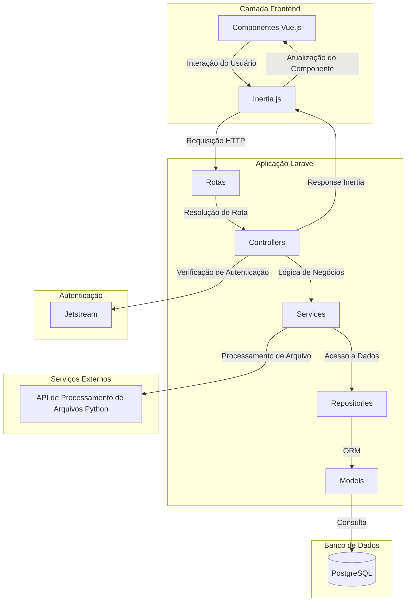

# Documento de Arquitetura - MyWallet

## 1. Visão Geral do Sistema

Este documento descreve a arquitetura do sistema de gerenciamento financeiro pessoal MyWallet desenvolvido em Laravel 12, utilizando tecnologias modernas para proporcionar uma experiência de usuário fluida e uma arquitetura robusta e escalável.

### 1.1 Stack

- **Backend Framework:** Laravel 12
- **Frontend Framework:** Vue.js 3
- **Frontend-Backend Integration:** Inertia.js
- **Database:** PostgreSQL
- **Authentication/Authorization:** Laravel Jetstream  
- **Containerization:** Docker
- **File Processing Service:** API Python (Flask/FastAPI)
- **Development Environment:**A Docker Compose

### 1.2 Objetivos Arquiteturais

- **Separação de Responsabilidades:** As diferentes camadas – apresentação, lógica de negócios e acesso a dados – devem ser claramente isoladas, promovendo uma estrutura organizada e de fácil manutenção.
- **Manutenibilidade:** Um código modular e bem estruturado facilita atualizações, correções e evolução constante do sistema.
- **Escalabilidade:** A arquitetura está preparada para crescimento horizontal, permitindo a adição de recursos conforme a demanda aumenta.
- **Experiência do Usuário:** Uma interface dinâmica e responsiva, com Vue.js, garante interações fluidas e uma experiência atraente para o usuário.
- **Segurança:** A implementação de práticas robustas, utilizando Jetstream, assegura a proteção dos dados e a integridade do sistema.

<div style="page-break-before: always;"></div>

## 2. Arquitetura Laravel + Inertia.js + Vue.js

### 2.1 Fluxo de Requisições

```
[Browser] → [Laravel Routes] → [Controller] → [Service] → [Repository] → [Model] → [Database]
                ↓
[Vue.js Component] ← [Inertia.js Response] ← [Controller]
```

### 2.2 Inertia.js - O Elo de Ligação

O Inertia.js atua como uma ponte entre o Laravel (backend) e Vue.js (frontend), eliminando a necessidade de uma API REST tradicional e proporcionando:

#### Características Principais

- **Roteamento Server-Side:** Utiliza as rotas do Laravel
- **Sem Endpoints de API:** Comunicação direta através de controllers
- **SPA Experience:** Navegação sem reload de página
- **Renderização Server-Side:** Renderização inicial no servidor

#### Fluxo de Dados

1. **Request:** Browser faz requisição para rota Laravel
2. **Processamento:** Controller processa a requisição usando Services/Repositories
3. **Responses:** Controller retorna dados via `Inertia::render()`
4. **Renderização:** Inertia.js renderiza componente Vue.js com os dados

### 2.3 Integração Vue.js

#### Componentes Vue.js

```javascript
// Exemplo de um componente de filtro no vue
<script setup>
import { ref } from 'vue';

const props = defineProps({
  loading: Boolean,
});

const emit = defineEmits(['update', 'reset']);

function onChange() {
  emit('update');
}

function onReset() {
  emit('reset');
}
</script>

<template>
  <div class="bg-white overflow-hidden shadow-sm sm:rounded-lg mb-6">
    <div class="p-6 border-b border-gray-200">
      <h2 class="text-xl font-semibold mb-4">Filtros</h2>
      <div class="grid grid-cols-1 md:grid-cols-4 gap-4">
        <slot :onChange="onChange" />
        <div class="flex items-end">
          <button 
            @click="onReset" 
            class="bg-gray-500 hover:bg-gray-700 text-white font-bold py-2 px-4 rounded transition-colors duration-200"
            :disabled="loading"
          >
            <span v-if="loading" class="inline-flex items-center">
              <svg class="animate-spin -ml-1 mr-3 h-5 w-5 text-white" xmlns="http://www.w3.org/2000/svg" fill="none" viewBox="0 0 24 24">
                <circle class="opacity-25" cx="12" cy="12" r="10" stroke="currentColor" stroke-width="4"></circle>
                <path class="opacity-75" fill="currentColor" d="M4 12a8 8 0 018-8V0C5.373 0 0 5.373 0 12h4zm2 5.291A7.962 7.962 0 014 12H0c0 3.042 1.135 5.824 3 7.938l3-2.647z"></path>
              </svg>
              Carregando...
            </span>
            <span v-else>Limpar Filtros</span>
          </button>
        </div>
      </div>
    </div>
  </div>
</template>
```

#### Características da Integração:

- **Dados reativos:** Vue.js gerencia reatividade no frontend
- **Component-Based:** Arquitetura componentizada reutilizável
- **Comunicação de dados via props:** Dados passados via props do Inertia
- **Eventos:** Eventos Vue.js integrados com formulários Inertia

<div style="page-break-before: always;"></div>

## 3. Arquitetura em Camadas

## 3.1 Estrutura das Camadas

| Camada             | Descrição                           |
| ------------------ | ----------------------------------- |
| **Apresentação**   | Vue.js Views                        |
| **Controllers**     | Laravel HTTP Controllers            |
| **Services**  | Business Logic Services             |
| **Repositories**     | Camda de Acesso aos Dados                 |
| **Models**    | Eloquent ORM Models                 |
| **Banco de Dados**       | PostgreSQL                          |

### 3.2 Responsabilidades das Camadas

#### **Views (Vue.js)**

- **Responsabilidade:** Interface do usuário e experiência do usuário
- **Componentes:**
  - Formulários de lançamentos e outras coisass relacionadas
  - Dashboards, gráficos e relatórios
  - Navegação e layout

#### **Controller (Laravel)**

- **Responsabilidade:** Coordenação entre requisições HTTP e lógica de negócios
- **Funções:**
  - Validação de requests
  - Delegação para services
  - Formatação de responses
  - Gerenciamento de sessões

```php
class LancamentoController extends Controller
{
    protected $categoriaRepository;
    protected $lancamentoRepository;

    public function __construct(CategoriaRepository $categoriaRepository, LancamentoRepository $lancamentoRepository)
    {
        $this->categoriaRepository = $categoriaRepository;
        $this->lancamentoRepository = $lancamentoRepository;
    }

    public function index(Request $request)
    {
        $filtros = $request->only(['categoria_id', 'ano', 'mes']);

        $userId = $request->user()->id;
        $lancamentos = $this->lancamentoRepository->paginateLancamentosDoUsuarioComCategoria($filtros, $userId, 10);

        $categorias = $this->categoriaRepository->getCategoriasDoUsuario($userId);

        return Inertia::render('Lancamentos/Index', [
            'filtros' => $filtros,
            'lancamentos' => $lancamentos,
            'categorias' => $categorias,
        ]);
    }
}
```

#### **Services**

- **Responsabilidade:** Lógica de negócios e orquestração de diferentes repositories
- **Funções:**
  - Regras de negócio complexas
  - Coordenação entre múltiplos repositories
  - Processamento de dados
  - Validações de negócio


#### **Repository Layer**

- **Responsabilidade:** Abstração de acesso a dados
- **Funções:**
  - Queries complexas
  - Abstração do Eloquent ORM
  - Caching de consultas
  - Padronização de acesso a dados

```php
class LancamentoRepository
{
    /** @var Lancamento */
    protected $model;

    public function __construct(Lancamento $lancamento)
    {
        $this->model = $lancamento;
    }

    public function getLancamentosDoUsuarioComCategoria($userId)
    {
        return $this->model::with('categoria:id,nome')->where('user_id', $userId)->get();
    }

    public function paginateLancamentosDoUsuarioComCategoria(array $filtros, $userId, int $paginas = 10)
    {
        $query = $this->model::with('categoria:id,nome')
            ->where('user_id', $userId);

        if (! empty($filtros['categoria_id'])) {
            $query->where('categoria_id', $filtros['categoria_id']);
        }

        if (! empty($filtros['tipo'])) {
            $query->where('tipo', $filtros['tipo']);
        }

        if (! empty($filtros['ano'])) {
            $query->whereYear('data', $filtros['ano']);
        }

        if (! empty($filtros['mes'])) {
            $query->whereMonth('data', $filtros['mes']);
        }

        return $query->paginate($paginas);

    }
}
```

#### **Model Layer**

- **Responsabilidade:** Representação de entidades e relacionamentos
- **Funções:**
  - Definição de relacionamentos
  - Scopes
  - Validações de modelo

<div style="page-break-before: always;"></div>

## 4. Comunicação com API Python

### 4.1 Arquitetura do Serviço de Processamento

```
┌──────────────────┐    HTTP POST    ┌──────────────────┐
│   Laravel App    │ ───────────────► │   Python API       │
│                  │                  │   (Flask/FastAPI)  │
│ FileController   │                  │                    │
│                  │ ◄─────────────── │ File Processor     │
└──────────────────┘    JSON Response └────────────────────┘
```

### 4.2 Fluxo de Processamento de Extratos

#### Etapa 1: Upload no Laravel

```php
class ImportController extends Controller
{
    /**
     * Exibe a tela de importação de lançamentos
     */
    public function index()
    {
        return Inertia::render('Lancamentos/Imports');
    }

    /**
     * Processa a importação de planilhas (CSV/XLSX)
     */
    public function importArquivos(Request $request)
    {
        $request->validate([
            'files' => 'required|array',
            'files.*' => 'file|mimes:csv,xlsx,xls|max:10240', // 10MB max
        ]);

        // TODO: Implementar lógica de importação de arquivos
        // - Processar arquivos CSV/XLSX
        // - Validar estrutura das planilhas
        // - Importar dados para o banco
        // - Retornar resultado da importação

        return redirect()->route('lancamentos.import')->with('error', 'Essa funcionalidade ainda será implementada. Tente novamente em breve.');
    }
}
```

<div style="page-break-before: always;"></div>

#### Etapa 2: Processamento na API Python

```python
from fastapi import APIRouter
from fastapi import File, UploadFile
from typing import Optional
from pydantic import BaseModel
from fastapi import HTTPException, status
import logging
from api.V1.funcoes_banco import csv_brasil_para_dict, criar_df_brasil

router = APIRouter()

class LancamentoBB(BaseModel):
    data: Optional[str]  # Changed to str to match the output
    descricao: str
    detalhes: str
    numero_documento: Optional[str]  # Changed to str for consistency
    valor: float
    tipo_lancamento: Optional[str]

@router.post(
    "/brasil",
    summary="Extrato Banco do Brasil",
    description="Recebe um arquivo CSV do Banco do Brasil e retorna um JSON estruturado",
    response_model=list[LancamentoBB]
)

async def bb_file_to_json(file: UploadFile = File(...)):
    try:
        content = await file.read()
        if file.content_type in ["text/csv", "application/vnd.ms-excel","application/vnd.openxmlformats-officedocument.spreadsheetml.sheet"]:

            df = criar_df_brasil(file, content)
            if df.empty:
                raise HTTPException(
                    status_code=status.HTTP_400_BAD_REQUEST,
                    detail="O arquivo enviado ou e do tipo errado ou não contém dados válidos."
                )
            return csv_brasil_para_dict(df)

    except Exception as e:
        logging.error(f"Erro ao processar arquivo: {e}", exc_info=True)
        raise HTTPException(
            status_code=status.HTTP_500_INTERNAL_SERVER_ERROR,
            detail="Ocorreu um erro interno ao processar o arquivo"
        )
```

### 4.3 Benefícios da Arquitetura com um Serviço em Python

- **Especialização:** Python especializado em processamento de arquivos
- **Escalabilidade:** APIs podem ser escaladas independentemente
- **Tecnologia Apropriada:** Python para data processing, Laravel para web app
- **Manutenibilidade:** Código especializado em cada tecnologia

<div style="page-break-before: always;"></div>

## 5. Estrutura de Diretórios do Projeto Laravel

```
mywallet-app/
├── app/
│   ├── Actions/
│   │   ├── Fortify/
│   │   └── Jetstream/
│   ├── Http/
│   │   ├── Controllers/
│   │   │   ├── Controller.php
│   │   │   ├── CategoriaController.php
│   │   │   ├── DashboardController.php
│   │   │   ├── ImportController.php
│   │   │   ├── LancamentoController.php
│   │   │   ├── MetaController.php
│   │   │   └── OrcamentoController.php
│   │   ├── Requests/
│   │   └── Middleware/
│   ├── Models/
│   │   ├── User.php
│   │   ├── Categoria.php
│   │   ├── Lancamento.php
│   │   ├── Meta.php
│   │   └── Orcamento.php
│   ├── Repositories/
│   │   ├── CategoriaRepository.php
│   │   ├── DashboardRepository.php
│   │   ├── LancamentoRepository.php
│   │   ├── MetaRepository.php
│   │   └── OrcamentoRepository.php
│   ├── Services/
│   │   └── DashboardService.php
│   └── Providers/
│       ├── AppServiceProvider.php
│       ├── FortifyServiceProvider.php
│       └── JetstreamServiceProvider.php
├── resources/
│   ├── js/
│   │   ├── Components/
│   │   │   ├── ActionMessage.vue
│   │   │   ├── ApplicationLogo.vue
│   │   │   ├── BarChart.vue
│   │   │   ├── Filtro.vue
│   │   │   ├── LineChart.vue
│   │   │   ├── Messages.vue
│   │   │   ├── MyWalletLogo.vue
│   │   │   ├── Pagination.vue
│   │   │   ├── PieChart.vue
│   │   │   ├── Tabela.vue
│   │   │   └── Welcome.vue
│   │   ├── Layouts/
│   │   ├── Pages/
│   │   │   ├── Dashboard.vue
│   │   │   ├── Auth/
│   │   │   ├── Categorias/
│   │   │   ├── Lancamentos/
│   │   │   │   ├── Index.vue
│   │   │   │   ├── Create.vue
│   │   │   │   └── Imports.vue
│   │   │   ├── Metas/
│   │   │   ├── Orcamentos/
│   │   │   ├── Profile/
│   │   │   └── API/
│   │   ├── directives/
│   │   ├── app.js
│   │   └── bootstrap.js
│   ├── css/
│   ├── markdown/
│   └── views/
├── database/
│   ├── migrations/
│   │   ├── 0001_01_01_000000_create_users_table.php
│   │   ├── 0001_01_01_000001_create_cache_table.php
│   │   ├── 0001_01_01_000002_create_jobs_table.php
│   │   ├── 2025_05_25_144954_add_two_factor_columns_to_users_table.php
│   │   ├── 2025_05_25_145000_create_personal_access_tokens_table.php
│   │   ├── 2025_05_25_183105_create_categorias_table.php
│   │   ├── 2025_05_25_183106_create_lancamentos_table.php
│   │   ├── 2025_05_25_183200_create_metas_table.php
│   │   ├── 2025_05_25_183218_create_orcamentos_table.php
│   │   ├── 2025_09_08_190715_add_active_to_users_table.php
│   │   └── 2025_09_11_000001_add_indexes_to_lancamentos_table.php
│   ├── seeders/
│   └── factories/
│       └── UserFactory.php
├── api/
│   ├── Dockerfile
│   ├── main.py
│   ├── requirements.txt
│   └── api/
│       └── V1/
│           ├── endpoints/
│           └── funcoes_banco.py
├── routes/
│   ├── web.php
│   ├── api.php
│   └── console.php
├── config/
│   ├── app.php
│   ├── auth.php
│   ├── database.php
│   ├── fortify.php
│   ├── jetstream.php
│   └── sanctum.php
├── docker/
│   ├── php.ini
│   ├── common/
│   │   └── php-fpm/
│   ├── development/
│   └── production/
├── bootstrap/
├── storage/
├── tests/
├── vendor/
├── public/
├── lang/
├── scripts/
├── docs/
├── certbot/
├── html/
├── compose.dev.yaml
├── compose.prod.yaml
├── package.json
├── vite.config.js
├── tailwind.config.js
├── composer.json
└── README.md
```

<div style="page-break-before: always;"></div>

### 5.1 Descrição dos Diretórios Principais

#### **app/Http/Controllers/**

Controladores responsáveis por gerenciar as requisições HTTP e coordenar com os services.

#### **app/Repositories/**

Camada de abstração para acesso aos dados, implementando padrões de repository.

#### **app/Services/**

Lógica de negócios e orquestração entre diferentes repositories e APIs externas.

#### **resources/js/Components/**

Componentes Vue.js reutilizáveis organizados por funcionalidade.

#### **resources/js/Pages/**

Páginas principais da aplicação que utilizam os componentes.

<div style="page-break-before: always;"></div>

## 6. Diagramas de Arquitetura

### 6.1 Diagrama de Arquitetura Geral



### 6.2 Diagrama de Fluxo de Dados

@startuml
    !theme plain

    actor User
    participant "Vue.js" as Vue
    participant "Inertia.js" as Inertia
    participant "ImportController" as Controller
    participant "Service" as Service
    participant "LancamentoRepository" as Repository
    database "PostgreSQL" as DB
    participant "Python API" as API

    User -> Vue : Upload Extrato Bancário
    Vue -> Inertia : Form Submit
    Inertia -> Controller : POST /lancamentos/import
    Controller -> API : POST /api/v1/brasil
    API --> Controller : JSON Lançamentos
    Controller -> Repository : bulkCreateLancamentos()
    Repository -> DB : INSERT lancamentos
    DB --> Repository : Success
    Repository --> Controller : Lançamentos Criados
    Controller --> Inertia : Inertia Response
    Inertia --> Vue : Update Component
    Vue --> User : Success Message

    hide footbox
@enduml

<div style="page-break-before: always;"></div>

### 6.3 Diagrama de Relacionamento de Entidades


<div style="page-break-before: always;"></div>

## 7. Padrões de Design Implementados

### 7.1 Repository Pattern

**Objetivo:** Abstrair a camada de acesso a dados e centralizar queries complexas.

**Implementação:**

```php
class LancamentoRepository
{
    /** @var Lancamento */
    protected $model;

    public function __construct(Lancamento $lancamento)
    {
        $this->model = $lancamento;
    }

    public function getLancamentosDoUsuarioComCategoria($userId)
    {
        return $this->model::with('categoria:id,nome')->where('user_id', $userId)->get();
    }

    public function paginateLancamentosDoUsuarioComCategoria(array $filtros, $userId, int $paginas = 10)
    {
        $query = $this->model::with('categoria:id,nome')
            ->where('user_id', $userId);

        if (! empty($filtros['categoria_id'])) {
            $query->where('categoria_id', $filtros['categoria_id']);
        }

        if (! empty($filtros['tipo'])) {
            $query->where('tipo', $filtros['tipo']);
        }

        if (! empty($filtros['ano'])) {
            $query->whereYear('data', $filtros['ano']);
        }

        if (! empty($filtros['mes'])) {
            $query->whereMonth('data', $filtros['mes']);
        }

        return $query->paginate($paginas);
    }
}
```

### 7.2 Service Layer Pattern

**Objetivo:** Centralizar lógica de negócios e coordenar operações complexas.

### 7.3 Injestão de depenência

**Objetivo:** Facilitar testes e manter baixo acoplamento entre componentes.

### 7.4 Principio de Responsabilidade Única

**Objetivo:** Cada classe tem uma única responsabilidade bem definida.

<div style="page-break-before: always;"></div>

## 8. Considerações de Segurança

### 8.1 Autenticação e Autorização

- **Jetstream:** Gerenciamento completo de autenticação
- **Sanctum:** API tokens para comunicação com serviços externos
- **Policies:** Controle granular de acesso a recursos

### 8.2 Comunicação Segura

- **HTTPS:** Comunicação criptografada
- **API Keys:** Autenticação entre Laravel e Python API

## 9. Deploy e DevOps

### 9.1 Containerização com Docker

A aplicação está totalmente dockerizada, utilizando uma arquitetura baseada em containers que garante consistência entre ambientes de desenvolvimento e produção. O sistema é composto por múltiplas imagens Docker especializadas:

#### Imagens Docker:

1. **Web Server Container (Nginx)**

- Servidor web Nginx para servir assets estáticos
- Proxy reverso para PHP-FPM
- Configuração SSL/TLS com Let's Encrypt

2. **PHP-FPM Application Container**

- PHP-FPM com extensões necessárias
- Código da aplicação Laravel
- Health checks para monitoramento

3. **PHP-CLI Container**

- Interface de linha de comando para tarefas administrativas
- Execução de migrations e seeders
- Jobs e comandos Artisan

4. **PostgreSQL Database Container**

- Banco de dados relacional PostgreSQL 15
- Volumes persistentes para dados
- Health checks e configurações otimizadas

5. **Redis Container**

- Cache em memória para sessões e jobs
- Melhoria de performance da aplicação

6. **Certbot Container**

- Renovação automática de certificados SSL
- Integração com Let's Encrypt

### 9.2 Orquestração com Docker Compose

A comunicação e orquestração entre os containers é gerenciada pelo Docker Compose, que define toda a infraestrutura como código e facilita o deploy em diferentes ambientes.

### 9.3 Benefícios da Arquitetura Dockerizada

- **Portabilidade:** Ambiente consistente em qualquer infraestrutura
- **Isolamento:** Cada serviço opera em seu próprio container
- **Escalabilidade:** Fácil replicação de containers conforme demanda
- **Manutenção:** Atualizações isoladas sem afetar outros serviços
- **Monitoramento:** Health checks garantem disponibilidade dos serviços
- **Segurança:** SSL/TLS automático com renovação de certificados

### 9.4 Rede e Comunicação entre Containers

Os containers comunicam-se através de uma rede Docker privada (`mywallet-production`), onde:

- O **Nginx** atua como proxy reverso para o **PHP-FPM**
- O **PHP-FPM** acessa o **PostgreSQL** pelo hostname `postgres`
- O **Redis** fornece cache para a aplicação Laravel
- O **Certbot** renova automaticamente certificados SSL
- Portas expostas apenas quando necessário para acesso externo
- Variáveis de ambiente gerenciam configurações sensíveis via arquivo env
- Health checks garantem que serviços dependentes estejam saudáveis antes da inicialização

### 9.5 CI/CD com GitHub Actions

O sistema implementa um pipeline de CI/CD automatizado utilizando GitHub Actions, garantindo deploys seguros e consistentes através de dois workflows principais: build.yaml e deploy.yaml, 

- **GitHub Container Registry (GHCR):** Armazenamento seguro e versionado das imagens Docker
- **Automação Completa:** Deploy automático a cada push na branch main
- **Rollback Facilitado:** Possibilidade de reverter para versões anteriores rapidamente
- **Limpeza Automática:** Remoção de containers e imagens antigas para economizar espaço

<div style="page-break-before: always;"></div>

## 10. Conclusão

Esta arquitetura proporciona uma base sólida para o sistema mywallet, combinando as melhores práticas de desenvolvimento web moderno:

### 10.1 Vantagens da Arquitetura Escolhida

- **Experenência do desenvolvedor:** Inertia.js elimina complexidade de APIs REST
- **Performance:** SPA experience sem overhead de framework JavaScript completo
- **Manutenção:** Separação clara de responsabilidades em camadas
- **Escalabilidade:** Serviço especializado em processamento (Python API)
- **Segurança:** Laravel Jetstream com práticas de segurança estabelecidas

### 10.2 Próximos Passos

- **Implementação de testes automatizados**
- **Backup automatizado do banco de dados**

*Documento criado em: 19/05/2025*  
*Versão: 1.0*  
*Autor: Grupo MyWallet*
